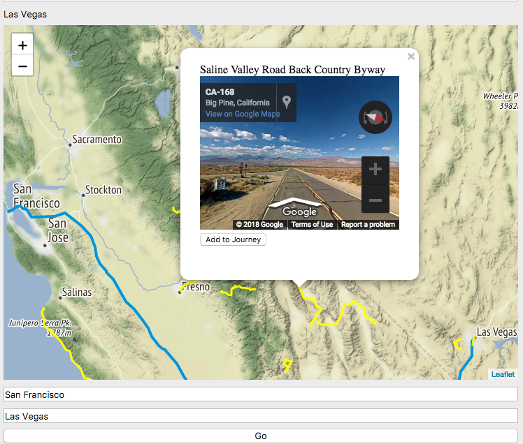

# Ruta Pan'merica
-----------------
rutascenic is a desktop application that allows users to find scenic route alternatives to their journey.
it currently works with the dataset of 850 designated scenic routes in US (federal and state). maintained on scenicbyways.info and presents it to the user as selectable paths on a map, to plan road-trips in a simple and speedy application.
It allows users to plan a trip, select and see pictures of nearby scenic routes, add the route to the trip or annotate it.
It can export to a file that can be opened on mobile mapping applications ~~ or to a printable markdown of the route~~.

**Use Case**: Leela opens the application on her laptop computer and is presented with a map centered on her location and textbox to enter a destination. She is then presented with the quickest route to her destination, and the scenic routes in her view are highlighted. She can click a scenic route to get more information– streetviews, notes, times and distances. If she likes what she sees and she adds the route to her trip. The application then includes the scenic route in the path displayed. She is able to add another destination and repeat the process. She can name and save the trip, or close the application and come back to the working copy.

  

### User Needs Analysis 
-------------------
__Need__: Leela loves to go on road-trips and believes the journey is more important than the destination. She prefers scenic routes instead of highways and likes to discover new routes between destinations.
She likes to plan her route with a computer at home and then carry it with her on the phone, and keep a paper copy just in case.

__Problem__: Currently Leela uses two different approaches depending on the scale of her trip.
For longer trips she uses a comprehensive road-trip planning web-application, Furkot, that is complex, has more features than she needs and can be cumbersome on slower internet connections.
For shorter trips, she uses a combination of Google Maps and internet research. She opens multiple tabs and create routes from scratch. Sometimes making notes on paper, sometimes on her computer.

__Solution__: She wants a simple, single application she can use to find the scenic routes along the trip she is planning and she also wants to keep a record of the roads she’s driven on and what she liked about them, so she can review whether to use them again. She wants to export the route to her phone and she wants a print out. ‘Ruta Panomerica’ serves her purpose well.

Features:

1.	Mapping: Display and Interact with Digital Maps
2.	Routing: Add destinations and find paths between them.
3.	Scenic Routes: Access and Present Database Visually
4.	Search: Access city/street/zip Database on the Web
5.	~~Pictures: Access and Display on route~~
5.  Google Street view
6.	Notes: Add and Display
7.	~~Export: To map file and image for print~~
8.	Save: Allow the user to ~~Name~~ and Save trips

Notes:

-	Must contain scenic route databases on local install
-	Should allow User to save target area maps on local storage
-	Closing the application should save the working state

Documentation
========================

Installation/Libraries
-------------
- Install Python 3
- Install PyQt5
- Install Folium:
  `pip install folium`
- include geocoder
- include polyline

Run rutascenic.py

Program Structure
-----------------
### rutascenic.py
- QMainWindow
- QWebEngineView
- Graphopper API requests
- StreetView API requests

### scenicroutemodel.py
- Scenic Route DB

### html/popup.js
- QtWebChannel interactions

## System Actions
- Geocode locations using inbuilt python geocoder
- Request Graphhopper for quickest route
- Use bounding box of route to search nearby scenic routes in db +
- Use coordinates on the route to request for the StreetView
- Add popups to each route, with the above response in an iframe
- Onclick, access the dict where the routes notes are stored.
- Save notes on editingFinished, save journey in a pickled list.

Copyright
Vidit Manglani

PyQt application
Folium
Javascript Mapping
Leaflet
